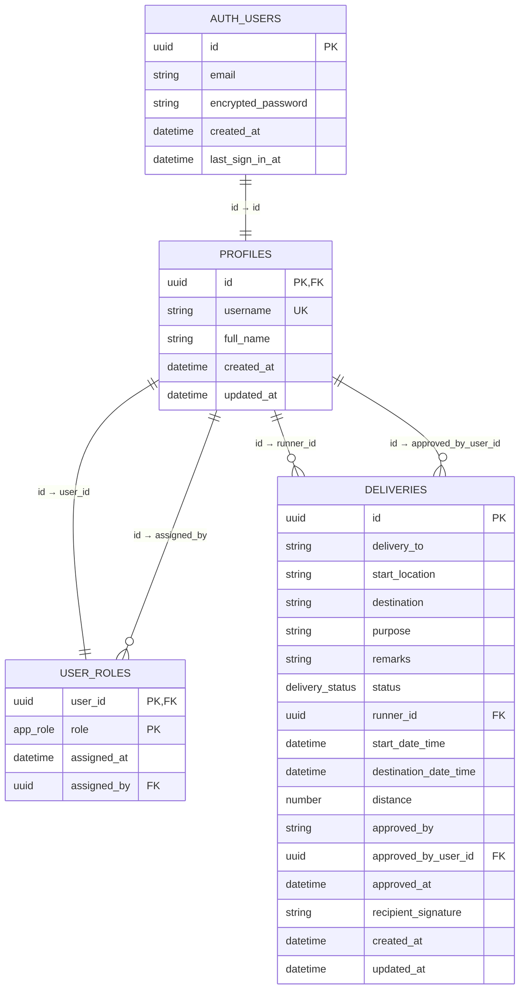

# ER Diagram — Database Tables & Relations

```mermaid
erDiagram
    AUTH_USERS {
        uuid id PK
        string email
        string encrypted_password
        datetime created_at
        datetime last_sign_in_at
    }

    PROFILES {
        uuid id PK, FK
        string username UK
        string full_name
        datetime created_at
        datetime updated_at
    }

    USER_ROLES {
        uuid user_id PK, FK
        app_role role PK
        datetime assigned_at
        uuid assigned_by FK
    }

    DELIVERIES {
        uuid id PK
        string delivery_to
        string start_location
        string destination
        string purpose
        string remarks
        delivery_status status
        uuid runner_id FK
        datetime start_date_time
        datetime destination_date_time
        number distance
        string approved_by
        uuid approved_by_user_id FK
        datetime approved_at
        string recipient_signature
        datetime created_at
        datetime updated_at
    }

    AUTH_USERS ||--|| PROFILES : "id → id"
    PROFILES ||--|| USER_ROLES : "id → user_id"
    PROFILES ||--o{ DELIVERIES : "id → runner_id"
    PROFILES ||--o{ DELIVERIES : "id → approved_by_user_id"
    PROFILES ||--o{ USER_ROLES : "id → assigned_by"
```
