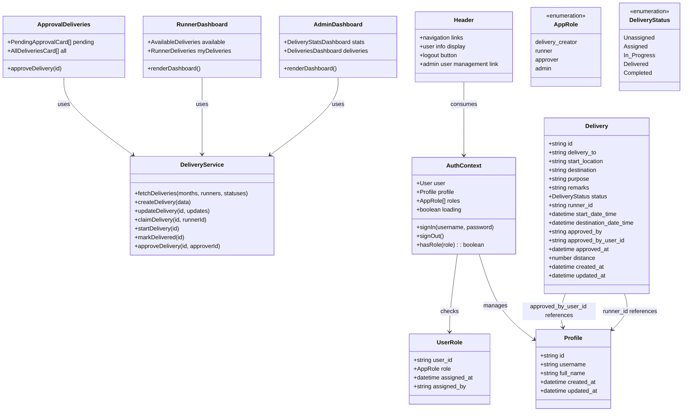

# Class Diagram — Major Components & Relationships

```mermaid
classDiagram
    class AuthContext {
        +User user
        +Profile profile
        +AppRole[] roles
        +boolean loading
        +signIn(username, password)
        +signOut()
        +hasRole(role): boolean
    }

    class DeliveryService {
        +fetchDeliveries(months, runners, statuses)
        +createDelivery(data)
        +updateDelivery(id, updates)
        +claimDelivery(id, runnerId)
        +startDelivery(id)
        +markDelivered(id)
        +approveDelivery(id, approverId)
    }

    class Profile {
        +string id
        +string username
        +string full_name
        +datetime created_at
        +datetime updated_at
    }

    class UserRole {
        +string user_id
        +AppRole role
        +datetime assigned_at
        +string assigned_by
    }

    class Delivery {
        +string id
        +string delivery_to
        +string start_location
        +string destination
        +string purpose
        +string remarks
        +DeliveryStatus status
        +string runner_id
        +datetime start_date_time
        +datetime destination_date_time
        +string approved_by
        +string approved_by_user_id
        +datetime approved_at
        +number distance
        +datetime created_at
        +datetime updated_at
    }

    class AdminDashboard {
        +DeliveryStatsDashboard stats
        +DeliveriesDashboard deliveries
        +renderDashboard()
    }

    class RunnerDashboard {
        +AvailableDeliveries available
        +RunnerDeliveries myDeliveries
        +renderDashboard()
    }

    class ApprovalDeliveries {
        +PendingApprovalCard[] pending
        +AllDeliveriesCard[] all
        +approveDelivery(id)
    }

    class Header {
        +navigation links
        +user info display
        +logout button
        +admin user management link
    }

    AuthContext --> Profile : manages
    AuthContext --> UserRole : checks
    Delivery --> Profile : runner_id references
    Delivery --> Profile : approved_by_user_id references
    AdminDashboard --> DeliveryService : uses
    RunnerDashboard --> DeliveryService : uses
    ApprovalDeliveries --> DeliveryService : uses
    Header --> AuthContext : consumes

    class AppRole {
        <<enumeration>>
        delivery_creator
        runner
        approver
        admin
    }

    class DeliveryStatus {
        <<enumeration>>
        Unassigned
        Assigned
        In_Progress
        Delivered
        Completed
    }
```
