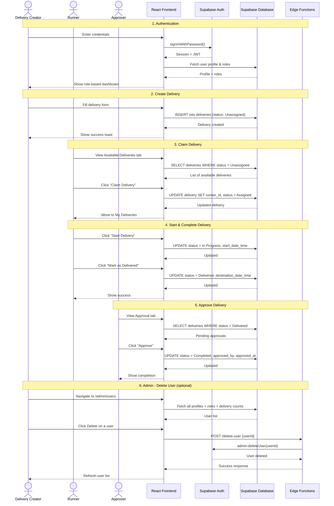

# Sequence Diagram — Main Delivery Flow (End-to-End)

```mermaid
sequenceDiagram
    actor Creator as Delivery Creator
    actor Runner as Runner
    actor Approver as Approver
    participant UI as React Frontend
    participant Auth as Supabase Auth
    participant DB as Supabase Database
    participant EF as Edge Functions

    Note over Creator, EF: 1. Authentication
    Creator->>UI: Enter credentials
    UI->>Auth: signInWithPassword()
    Auth-->>UI: Session + JWT
    UI->>DB: Fetch user profile & roles
    DB-->>UI: Profile + roles
    UI-->>Creator: Show role-based dashboard

    Note over Creator, EF: 2. Create Delivery
    Creator->>UI: Fill delivery form
    UI->>DB: INSERT into deliveries (status: Unassigned)
    DB-->>UI: Delivery created
    UI-->>Creator: Show success toast

    Note over Runner, EF: 3. Claim Delivery
    Runner->>UI: View Available Deliveries tab
    UI->>DB: SELECT deliveries WHERE status = Unassigned
    DB-->>UI: List of available deliveries
    Runner->>UI: Click "Claim Delivery"
    UI->>DB: UPDATE delivery SET runner_id, status = Assigned
    DB-->>UI: Updated delivery
    UI-->>Runner: Move to My Deliveries

    Note over Runner, EF: 4. Start & Complete Delivery
    Runner->>UI: Click "Start Delivery"
    UI->>DB: UPDATE status = In Progress, start_date_time
    DB-->>UI: Updated
    Runner->>UI: Click "Mark as Delivered"
    UI->>DB: UPDATE status = Delivered, destination_date_time
    DB-->>UI: Updated
    UI-->>Runner: Show success

    Note over Approver, EF: 5. Approve Delivery
    Approver->>UI: View Approval tab
    UI->>DB: SELECT deliveries WHERE status = Delivered
    DB-->>UI: Pending approvals
    Approver->>UI: Click "Approve"
    UI->>DB: UPDATE status = Completed, approved_by, approved_at
    DB-->>UI: Updated
    UI-->>Approver: Show completion

    Note over Creator, EF: 6. Admin - Delete User (optional)
    Creator->>UI: Navigate to /admin/users
    UI->>DB: Fetch all profiles + roles + delivery counts
    DB-->>UI: User list
    Creator->>UI: Click Delete on a user
    UI->>EF: POST /delete-user {userId}
    EF->>Auth: admin.deleteUser(userId)
    Auth-->>EF: User deleted
    EF-->>UI: Success response
    UI-->>Creator: Refresh user list
```
