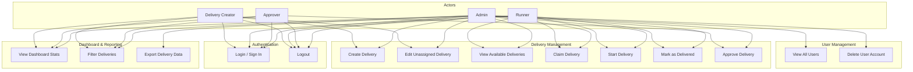

# Use Case Diagram

```mermaid
graph TB
    subgraph Actors
        Creator["Delivery Creator"]
        Runner["Runner"]
        Approver["Approver"]
        Admin["Admin"]
    end

    subgraph "Authentication"
        UC1["Login / Sign In"]
        UC2["Logout"]
    end

    subgraph "Delivery Management"
        UC3["Create Delivery"]
        UC4["Edit Unassigned Delivery"]
        UC5["View Available Deliveries"]
        UC6["Claim Delivery"]
        UC7["Start Delivery"]
        UC8["Mark as Delivered"]
        UC9["Approve Delivery"]
    end

    subgraph "Dashboard & Reporting"
        UC10["View Dashboard Stats"]
        UC11["Filter Deliveries"]
        UC12["Export Delivery Data"]
    end

    subgraph "User Management"
        UC13["View All Users"]
        UC14["Delete User Account"]
    end

    Creator --> UC1
    Creator --> UC2
    Creator --> UC3
    Creator --> UC4
    Creator --> UC10
    Creator --> UC11

    Runner --> UC1
    Runner --> UC2
    Runner --> UC5
    Runner --> UC6
    Runner --> UC7
    Runner --> UC8

    Approver --> UC1
    Approver --> UC2
    Approver --> UC9
    Approver --> UC10
    Approver --> UC11

    Admin --> UC1
    Admin --> UC2
    Admin --> UC3
    Admin --> UC4
    Admin --> UC5
    Admin --> UC6
    Admin --> UC7
    Admin --> UC8
    Admin --> UC9
    Admin --> UC10
    Admin --> UC11
    Admin --> UC12
    Admin --> UC13
    Admin --> UC14
```
